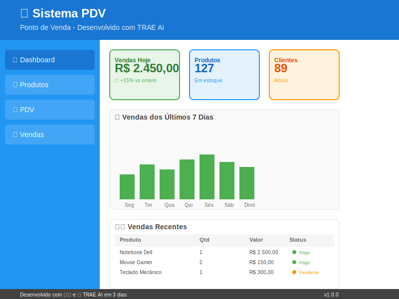

# 🛒 Sistema PDV (Ponto de Venda)

> **Projeto desenvolvido inteiramente com a ajuda do TRAE AI em apenas 3 dias como estudo da ferramenta de desenvolvimento assistido por IA.**



## 📋 Sobre o Projeto

Este é um sistema completo de Ponto de Venda (PDV) desenvolvido para demonstrar as capacidades do TRAE AI na criação de aplicações full-stack. O projeto foi concebido e implementado em **apenas 3 dias** utilizando exclusivamente a assistência da IA TRAE para:

- Arquitetura do sistema
- Desenvolvimento do backend em Go
- Criação do frontend em React
- Implementação do banco de dados

- Testes e debugging
- Formatação e padronização de código

## 🚀 Tecnologias Utilizadas

### Backend
- **Go** (Golang)
- **Gin** (Framework web)
- **GORM** (ORM)
- **SQLite** (Banco de dados)
- **JWT** (Autenticação)
- **bcrypt** (Hash de senhas)

### Frontend
- **React** 18
- **Material-UI** (MUI)
- **React Hook Form**
- **Axios** (Cliente HTTP)
- **Vite** (Build tool)

## ✨ Funcionalidades

### 🔐 Autenticação e Autorização
- Login/Logout seguro
- Controle de acesso por níveis (Admin, Gerente, Vendedor)
- Tokens JWT para sessões

### 📦 Gestão de Produtos
- Cadastro, edição e exclusão de produtos
- Controle de estoque
- Categorização de produtos
- Código de barras
- Alertas de estoque baixo

### 🛍️ Sistema de Vendas (PDV)
- Interface intuitiva para vendas
- Leitura de código de barras
- Múltiplos métodos de pagamento:
  - Dinheiro (com cálculo de troco)
  - Cartão de Crédito
  - Cartão de Débito
  - PIX
- Aplicação de descontos
- Formatação automática de valores monetários


### 📊 Relatórios e Dashboard
- Dashboard com estatísticas em tempo real
- Histórico de vendas
- Relatórios de produtos
- Controle de usuários

### 💰 Formatação Monetária
- Formatação automática para padrão brasileiro (R$ X.XXX,XX)
- Input inteligente que permite digitação natural
- Formatação aplicada ao perder foco do campo

## 🏗️ Arquitetura

```
PDV/
├── backend/                 # API em Go
│   ├── controllers/         # Controladores da API

│   ├── models/             # Modelos de dados
│   ├── services/           # Serviços de negócio
│   ├── middleware/         # Middlewares (auth, cors)
│   ├── routes/             # Definição de rotas
│   └── config/             # Configurações e database
└── frontend/               # Interface React
    ├── src/
    │   ├── components/     # Componentes reutilizáveis
    │   ├── pages/          # Páginas da aplicação
    │   ├── contexts/       # Contextos React (Auth)
    │   ├── services/       # Comunicação com API
    │   └── utils/          # Utilitários (formatação, etc.)
    └── public/
```

## 🚀 Como Executar

## 🚀 Como Executar

### Pré-requisitos
- Go 1.21+
- Node.js 18+
- npm ou yarn

### Backend
```bash
cd backend
go mod tidy
cp .env.example .env
go run main.go
```

### Frontend
```bash
cd frontend
npm install
npm run dev
```

### Acessos
- **Frontend**: http://localhost:5173
- **Backend**: http://localhost:8080

### Usuários Padrão
- **Admin**: admin@pdv.com / admin123
- **Gerente**: gerente@pdv.com / gerente123
- **Vendedor**: vendedor@pdv.com / vendedor123


## 🎯 Demonstração do TRAE AI

Este projeto serve como uma demonstração prática das capacidades do TRAE AI:

### ⚡ Velocidade de Desenvolvimento
- **3 dias** para um sistema completo de PDV
- Implementação simultânea de frontend e backend
- Integração automática entre componentes
- Funcionalidades completas implementadas rapidamente

### 🧠 Inteligência de Código
- Arquitetura bem estruturada
- Padrões de código consistentes
- Tratamento de erros robusto
- Validações de segurança
- Sistema de autenticação robusto

### 🔄 Iteração Rápida
- Correções instantâneas de bugs
- Implementação de novas funcionalidades em tempo real
- Refatoração automática de código
- Otimizações de performance
- Melhorias contínuas no sistema

### 🎨 Interface Moderna
- Design responsivo
- Componentes Material-UI
- UX intuitiva
- Formatação automática de dados
- Interface limpa e profissional

## 📈 Funcionalidades Destacadas

### 💳 Sistema de Pagamento Avançado
- Múltiplas formas de pagamento
- Cálculo automático de troco
- Validação de valores
- Interface intuitiva

### 🏷️ Formatação Monetária Inteligente
- Input que aceita digitação natural
- Formatação automática no padrão brasileiro
- Experiência de usuário otimizada

### 📊 Dashboard Interativo
- Estatísticas em tempo real
- Gráficos e métricas
- Controle de estoque
- Relatórios de vendas
- Visão geral do negócio

### 🔐 Sistema de Autenticação Robusto
- Controle de acesso por níveis
- Autenticação JWT segura
- Gerenciamento de usuários
- Proteção de rotas
- Sessões seguras

## 🤖 Sobre o TRAE AI

Este projeto foi desenvolvido para demonstrar como o TRAE AI pode:
- Acelerar drasticamente o desenvolvimento
- Manter alta qualidade de código
- Implementar funcionalidades complexas de PDV
- Criar interfaces modernas e responsivas
- Integrar tecnologias diferentes de forma seamless
- Desenvolver sistemas empresariais completos

## 📝 Licença

Este projeto foi criado para fins educacionais e de demonstração das capacidades do TRAE AI.

---

**Desenvolvido com ❤️ e 🤖 TRAE AI em 3 dias**